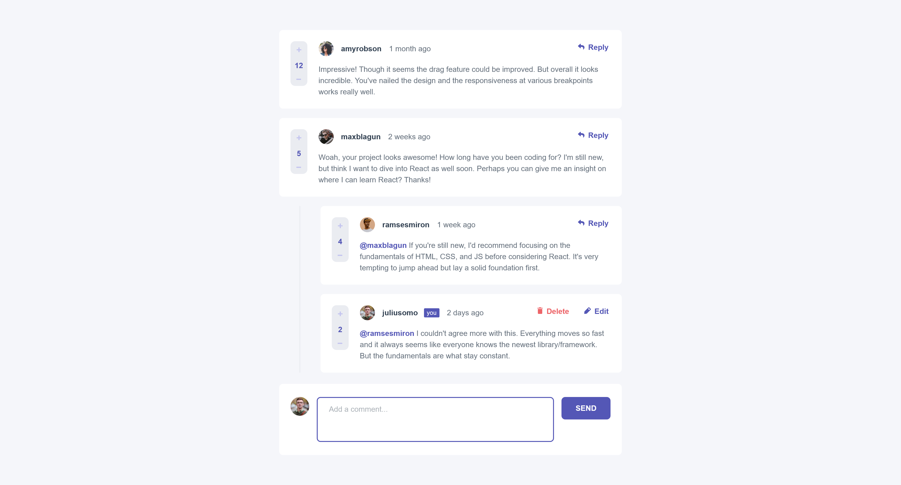

# Frontend Mentor - Interactive Comments Section

This is my solution to the [Interactive Comments Section challenge on Frontend Mentor](https://www.frontendmentor.io/challenges/interactive-comments-section-iG1RugEG9). Frontend Mentor challenges help you improve your coding skills by building realistic projects. The design is provided by Frontend Mentor, all code is written by me.

Live Site URL: https://interactive-comments-section-roan.vercel.app/

### Requirements

Users should be able to:

- Create, Read, Update, and Delete comments and replies
- Upvote and downvote comments
- View the optimal layout for the app depending on the device's screen size
- See hover states for all interactive elements on the page

### Goals

My goals in taking on this challenge included the following:

- Use React to build this challenge.
- Write semantic and accessible HTML.
- Work with a seperate JSON file for my source data
- Use recursion to be able to implement comments and (nested) replies with the same component
- Use the React context api
- Implement a reducer function to centralize all the CRUD logic relating to comments
- Use the Radix UI React component library to construct an unstyled modal. By using this component, I get focus control and good accessibility out of the box.
- Use CSS modules.
- Use hooks like useEffect and useRef, in combination with forwardRef to make the textarea grow automatically and move focus to the textarea when appropriate
- Use Immer to help keep my state immutable

### Screenshots of my implementation of the desktop layout

